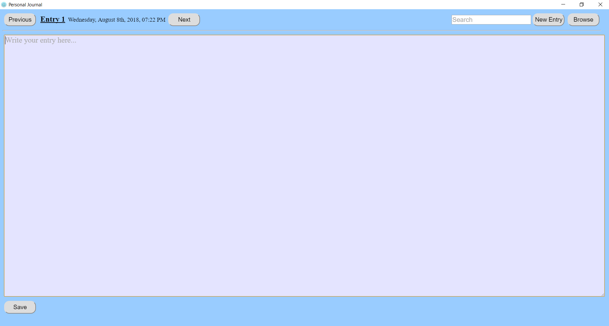
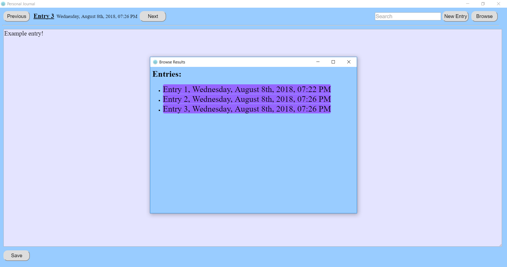
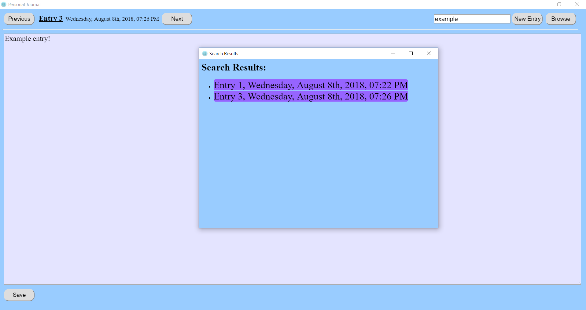

# PersonalJournal
A desktop journaling application powered by Electron and SQLite

# Features
PersonalJournal is a pretty basic journal.  You can write entries in plain text, like a diary.  Your entries are saved in a local SQLite database, and can be updated, browsed, and searched.  

## Write

Create a new entry by hitting the New Entry button in the upper right hand corner.  Write your entry, then press the Save button at the bottom.

## Browse

On the main window, navigate to previous and next entries using the Previous and Next buttons at the top.

Hit the Browse button in the upper right hand corner.  A new window will be displayed with a listing of all entries.  Scroll to the desired entry and click on it to display it on the main window.

## Update

To update a previous entry, browse to the desired entry.  Then, update the text and hit the Save button.

## Search

Type any search text in the search box and hit the Enter key.  A new Search window will be displayed with the search results.  Click on an entry in the Search window and the selected entry will be displayed on the main window.

# Future Ideas

I am not actively making updates to this application at this time, although I may return to it at some point.  If you have interest in seeing a new feature or an issue you would like to see fixed, submit an issue or a pull request and I'm happy to help.  I have some ideas for the future that I may make at some point:

- Notify the user if there is unsaved content and they try to navigate away, either to another entry or exiting the application
- Implement support for rich text
- Allow users to rename entries 
- Implement support for adding images, links, videos, and files in entries
- Implement different journal templates, e.g. mindfulness journals, food journals, exercise journals, etc.
